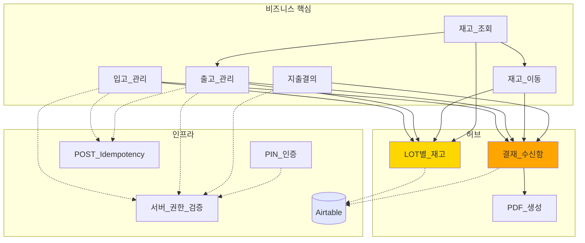
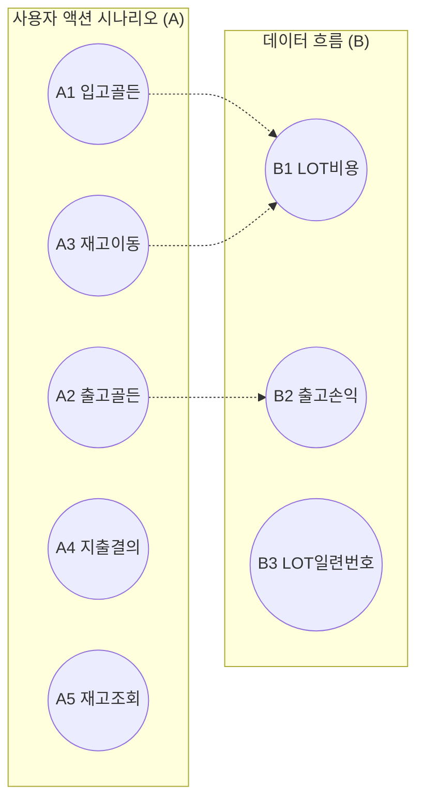

# ERP 핵심 구조 (큰 그림)

> 수동 관리. /wrap-up은 파일이 없을 때만 초기화하며, 존재 시 절대 덮어쓰지 않음.
> 시스템 구조 변경 시 이 파일을 직접 편집.

## 시스템 전체 관계도

화살표 의미:
- 실선: 직접 의존 / 데이터 흐름
- 점선: 권한 검증 / 부수 의존

## 핵심 시나리오 분포

## 관련 노트

**모듈** (Mermaid 노드 → 실제 노트):
- 입고 → [[입고_관리]]
- 출고 → [[출고_관리]]
- 이동 → [[재고_이동]]
- 조회 → [[재고_조회]]
- 지출 → [[지출결의]]
- LOT → [[LOT별_재고]]
- 결재 → [[결재_수신함]]
- PDF → [[PDF_생성]]
- PIN → [[PIN_인증]]
- 권한 → [[서버_권한_검증]]
- Idem → [[POST_Idempotency]]
- AT → Airtable (외부 SaaS — 운영 7개 + 마스터 4개 테이블)

**시나리오**:
- A1 → [[A1_입고_골든패스]]
- A2 → [[A2_출고_골든패스]]
- A3 → [[A3_재고이동_보관처_변경]]
- A4 → [[A4_지출_결의_골든패스]]
- A5 → [[A5_재고_조회_3단계_플로우]]
- B1 → [[B1_LOT_생성_시점_비용_적용]]
- B2 → [[B2_출고시점_비용_스냅샷_손익]]
- B3 → [[B3_LOT_일련번호_낙관적_재시도]]
