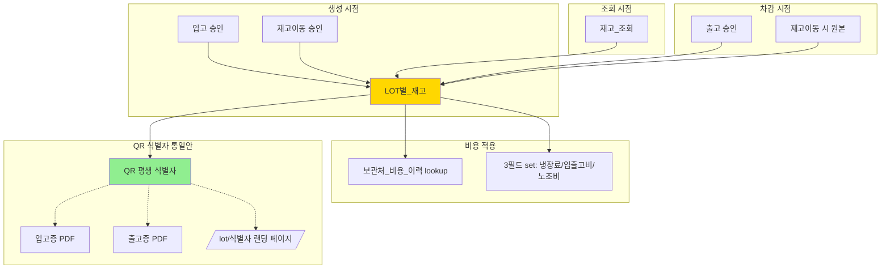
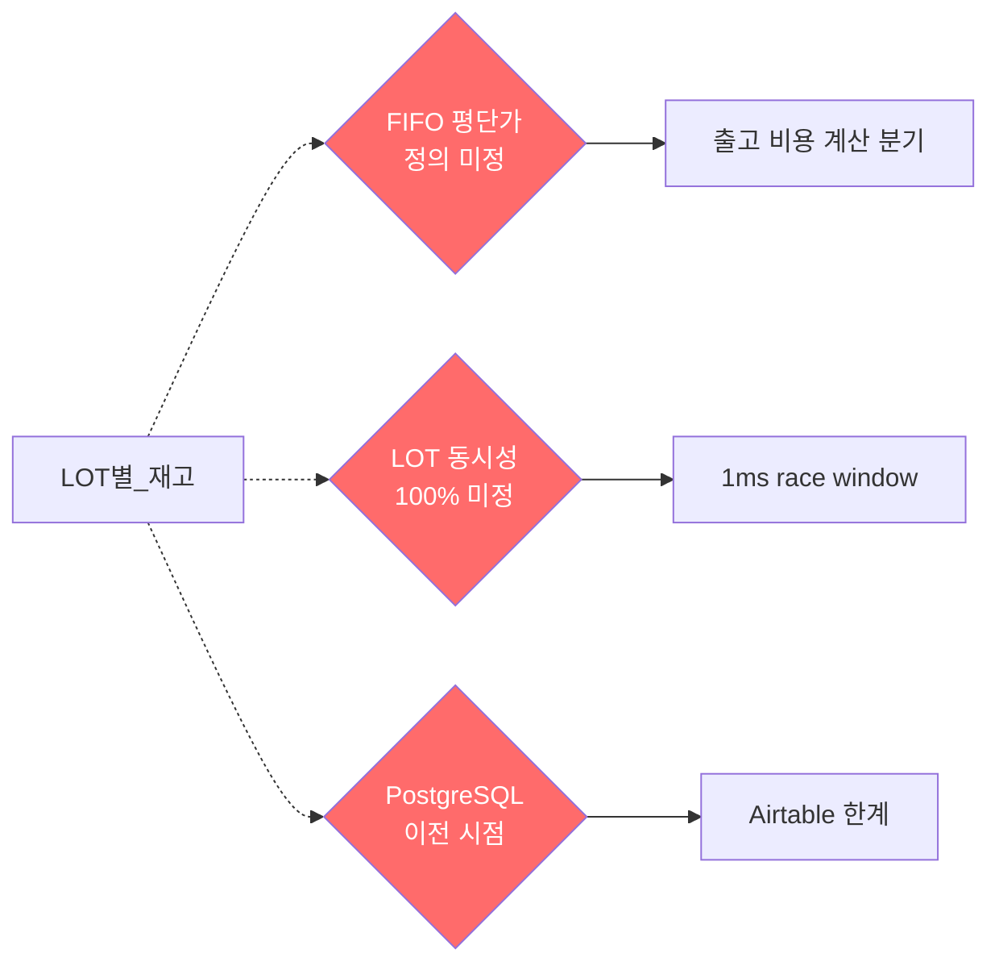

# LOT 관리 의존성 지도

> [[LOT별_재고]]는 ERP의 핵심 데이터 단위. 거의 모든 비즈니스 로직이 LOT을 거침.
> 마지막 갱신: 2026-05-08

## LOT을 거치는 모든 흐름

## 미해결 결정과의 관계

## 관련 노트

**모듈**:
- [[LOT별_재고]] (중심)
- [[입고_관리]] / [[출고_관리]] / [[재고_이동]] / [[재고_조회]]
- [[보관처_비용_이력]]
- [[PDF_생성]] / [[QR_스캔]]

**확정 결정**:
- [[QR_LOT_식별자_통합]]

**미해결 결정**:
- [[FIFO_평단가_시스템]]
- [[LOT동시성_100%_분산락]]
- [[PostgreSQL_이전_시점]]

**시나리오**:
- [[B1_LOT_생성_시점_비용_적용]]
- [[B2_출고시점_비용_스냅샷_손익]]
- [[B3_LOT_일련번호_낙관적_재시도]]
- [[E1_LOT_QR_평생_식별자]]
