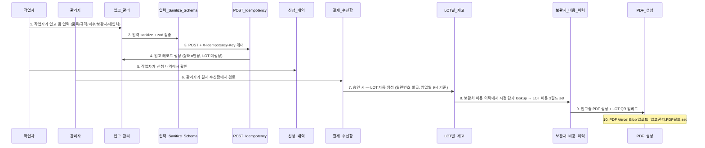

# A1 입고 골든패스

> 자동 생성. /wrap-up이 ## 흐름 변경 감지 시 갱신.
> 마지막 갱신: 2026-05-08

## 시퀀스

## 관련 노트

- [[A1_입고_골든패스]] (소스)
- 모듈: [[입고_관리]], [[입력_Sanitize_Schema]], [[POST_Idempotency]], [[신청_내역]], [[결재_수신함]], [[LOT별_재고]], [[보관처_비용_이력]], [[PDF_생성]]
- Actor: 작업자, 관리자
