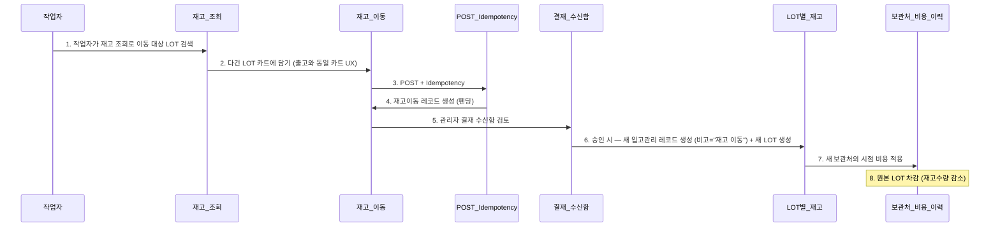

# A3 재고이동 보관처 변경

> 자동 생성. /wrap-up이 ## 흐름 변경 감지 시 갱신.
> 마지막 갱신: 2026-05-08

## 시퀀스

## 관련 노트

- [[A3_재고이동_보관처_변경]] (소스)
- 모듈: [[재고_조회]], [[재고_이동]], [[POST_Idempotency]], [[결재_수신함]], [[LOT별_재고]], [[보관처_비용_이력]]
- Actor: 작업자
