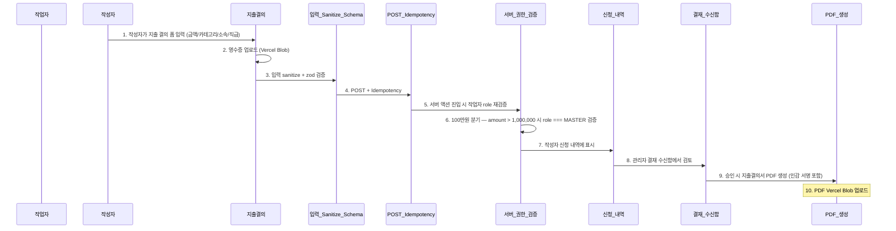

# A4 지출 결의 골든패스

> 자동 생성. /wrap-up이 ## 흐름 변경 감지 시 갱신.
> 마지막 갱신: 2026-05-08

## 시퀀스

## 관련 노트

- [[A4_지출_결의_골든패스]] (소스)
- 모듈: [[지출결의]], [[입력_Sanitize_Schema]], [[POST_Idempotency]], [[서버_권한_검증]], [[신청_내역]], [[결재_수신함]], [[PDF_생성]]
- Actor: 작업자, 작성자
