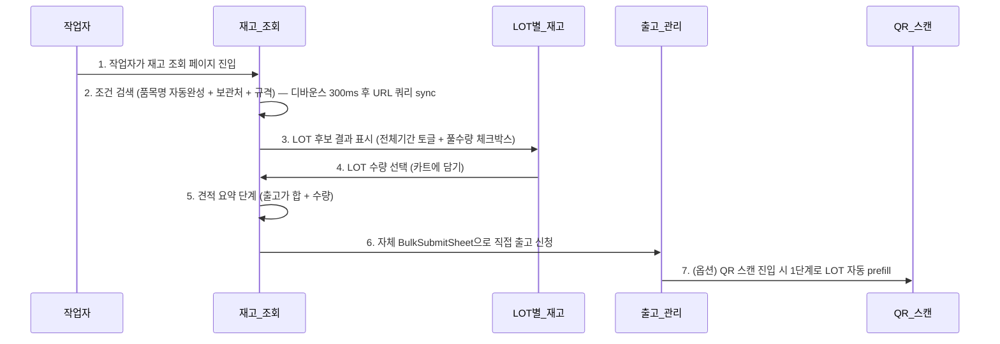

# A5 재고 조회 3단계 플로우

> 자동 생성. /wrap-up이 ## 흐름 변경 감지 시 갱신.
> 마지막 갱신: 2026-05-08

## 시퀀스

```mermaid
sequenceDiagram
    participant 작업자
    participant 재고_조회
    participant LOT별_재고
    participant 출고_관리
    participant QR_스캔

    작업자->>재고_조회: 1. 작업자가 재고 조회 페이지 진입
    재고_조회->>재고_조회: 2. 조건 검색 (품목명 자동완성 + 보관처 + 규격) — 디바운스 300ms 후 URL 쿼리 sync
    재고_조회->>LOT별_재고: 3. LOT 후보 결과 표시 (전체기간 토글 + 풀수량 체크박스)
    LOT별_재고->>재고_조회: 4. LOT 수량 선택 (카트에 담기)
    재고_조회->>재고_조회: 5. 견적 요약 단계 (출고가 합 + 수량)
    재고_조회->>출고_관리: 6. 자체 BulkSubmitSheet으로 직접 출고 신청
    출고_관리->>QR_스캔: 7. (옵션) QR 스캔 진입 시 1단계로 LOT 자동 prefill
```

## 관련 노트

- [[A5_재고_조회_3단계_플로우]] (소스)
- 모듈: [[재고_조회]], [[LOT별_재고]], [[출고_관리]], [[QR_스캔]]
- Actor: 작업자
