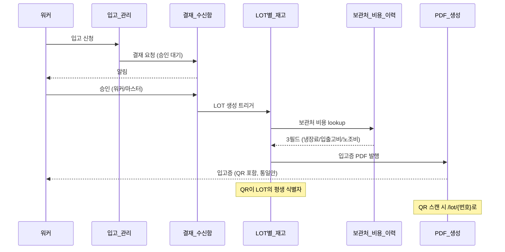
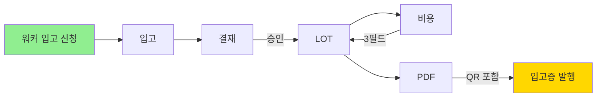

# 입고 골든패스 시나리오

> 시나리오 [[A1_입고_골든패스]]를 두 가지 다이어그램으로 시각화.
> 마지막 갱신: 2026-05-08

## 단계별 플로우 (시퀀스)

## 의존 관계도 (같은 시나리오를 다른 각도)

## 관련 노트

**시나리오**:
- [[A1_입고_골든패스]] (이 다이어그램의 본문)
- [[B1_LOT_생성_시점_비용_적용]] (비용 lookup 상세)
- [[E1_LOT_QR_평생_식별자]] (QR 통일안)

**모듈**:
- [[입고_관리]]
- [[결재_수신함]]
- [[LOT별_재고]]
- [[보관처_비용_이력]]
- [[PDF_생성]]
- [[QR_스캔]]

**관련 결정**:
- [[QR_LOT_식별자_통합]]
